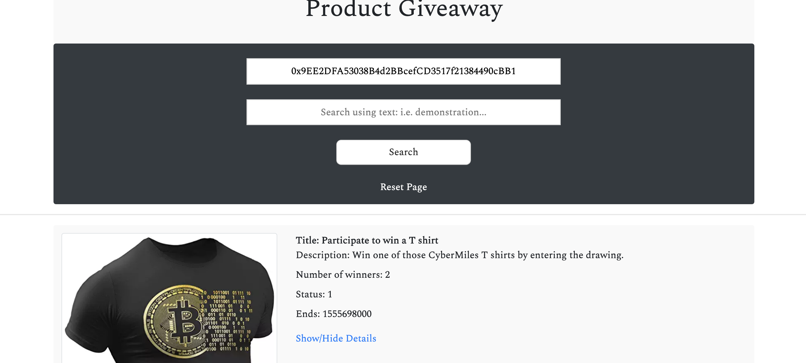
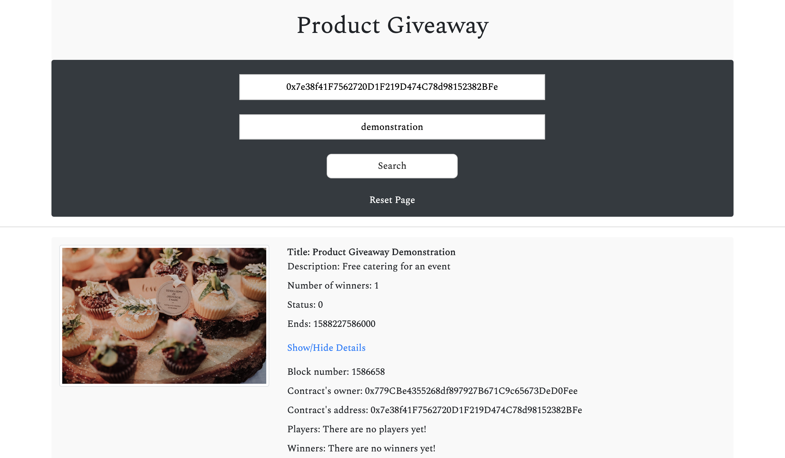
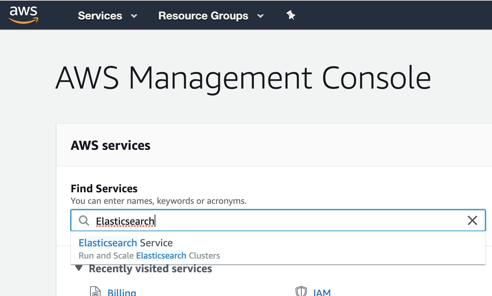

# Smart Contract Search Engine

This search engine is designed to run locally (from your file system without the need for a server).

This search engine can also be hosted publicly by simply copying this entire project into the htdocs folder of a LAMP server, as seen here < http://54.66.215.89/index.html >.

## Searching - Frontend

This system is running live at the following endpoint < http://54.66.215.89/index.html >. Please feel free to try it out, using the following examples of usage.

### Example usage

#### Search using address

You can search the system using the address of product-giveaway contract owners, product-giveaway players, product-giveaway winners and even product-giveaway smart contract addresses.



#### Search using plain text 

You can also search the system using plain text; for example try typing the word "demonstration" into the search box as shown below.


#### Search using both address and plain text

You can also search the system using plain text, with the addition of an address. The following example shows how the "demonstration" text (which produced 3 results above) is now filtered to a single contract address of `0x7e38f41F7562720D1F219D474C78d98152382BFe`. You can try this out for yourself, just paste in the address and text.

#### Show/Hide Details

To make the results cleaner, we have provided the clickable "Show / Hide Details" text. This will reveal or hide additional information such as the list of winners, block number of when the contract was last interacted with and so forth.




## Harvesting - Backend

The harvesting scripts are written in Python; they require a particular smart contract's ABI file and a link to the blockchain's RPC endpoint.

### Full - smart contract harvest

The Python file, at `python/SmartContractHarvesterFull.py` harvests the entire blockchain (in reverse, from the latest block, right back to the genesis block).

```python3
for blockNumber in reversed(range(latestBlockNumber)):
```

The full - smart contract harvest, technically, only needs to be run once. However, if you like you can set it to run once per day using a cron job such as the following. 

```bash
# m h  dom mon dow   command
45 22 * * * cd ~/htdocs/python && /usr/bin/python3 SmartContractHarvesterFull.py
# The above cron job will trigger at 10:45pm every day
# Please note that you can obtain your system's time using the "date" command
# Please note that the python path, for your unique system, can be obtained via the "which python3" command
```

Keep in mind, the full - smart contract harvest does check if each contract instance already exists (and so there is no real downside to running it daily or weekly). Think of this harvest as a full sweep of the entire blockchain.

You can check to see if the `SmartContractHarvesterFull.py` script is running via the following command.

```bash
ps ax | grep SmartContractHarvesterFull.py
```
**Note:** You can supress the output from the cron job by adding the following to the end of the line. This prevents the /var/mail of your OS from growing too large.
```
>/dev/null 2>&1
```

### Topup - smart contract harvest

The Python file, at `python/SmartContractHarvesterTopup.py` must be run regularly. This script, when run regularly, will index brand new smart contracts by scanning the most recent 350 blocks. 

```python3
stop = latestBlockNumber - 350
for blockNumber in reversed(range(stop, latestBlockNumber)):
```

The topup - smart contract harvest, can be run once per minute using the following cron job. Again, remember that this script will only index contract instances which do not already exist in the index. If a contract instance already exists this script will just skip over it and continue looking for new unindexed contract instances. This is a very cheap and efficient script; essentially just sweeps a finite amount of upper blocks in the chain over and over as time goes on.

```bash
* * * * * cd ~/htdocs/python && /usr/bin/python3 SmartContractHarvesterTopup.py
# The above cron job will trigger at every minute of every hour of every day
```

### Incremental  - smart contract **STATE** update

The above scripts primarily store the contract infrastructure (contract address, owner address etc.). Having the ABI and contract address means that we can create web3 instances of each contract instance; and then go ahead and read all of the contract's public variables. The above harvesting scripts do this **only once**.

The Python file, at `python/FairPlayStateUpdate.py` checks for changes in each contract's state in real-time. As soon as any change is detected, the main index is updated. The Python script does not repeatedly query the main index. Instead it locally compares hashes (hash(smart contract address + smart contract state)). This is very efficient and fast.

The output from the incremental smart contract state update looks like this (when contract state is unchanged)

```bash
No change to 0x681e5af3f8dd7d1955d97c7aa9d8d68d9a1417058a31a7210a4a7114e101b540 
No change to 0xac08f0dd1227ef9431aba9ebf8c6272a0cb892b1c76b86db96cf459961a55576 
No change to 0x3210380897fec52068ef12022ebb93f9628f7f0ca7f9c7b0c045ce9d45a4661f 
No change to 0xa6d92e264b53de0b994bc14b339f1bb7c32f8a9486f88dc40604a314b18627f0 
No change to 0xc587f558efa5f82fe1d3e433d73613f59758136ebe7f298fe10bc8af891952ba 
No change to 0x45259eb068e8137e75bcba0209ac6b9cefb07e127f3460af7ada2b14380e7d06 
No change to 0x7b539f070d764711cc190a7b08a9a86e0814079f948f0ec5bfc50275059a53ce 
No change to 0x2186fad80585434759fa81c6a6f04534c9048b6a01f6e374414fdccb9e8a36c7 
No change to 0xe44d14f137d76faca652cc274d9e49907805569823a1847faea5712afcc77808 
No change to 0xe4ae455e2a449bb3f1812ac87e3c7eddc3eae81aa4dc522ed41e083f69605975 
No change to 0x9e834391d8833f6111d419e527112639bbfdc2b17b64d8668b1e8be2731068ae 
No change to 0xf6d156c759fe4cbc0cf5f06e4928d5a65094718265f2c8fc19b3b8720ae22eb4 
No change to 0xc9699912089a75f22089dd781df3bfb8771ce80343ae8677ef26ffd8067c8759 
No change to 0x3b7eaa7f9e570361f78adcd65b001ed73e8fc76faac6e18bed593d8fac9a3e67 
No change to 0x31c6616092ee84469bf5758ada8b6c3830fe499a506ad68f4ea16e74c5e7acea 
No change to 0x99eac22abb8a5d04b1a2fec42ffa2251cd0e1748d5bd759e62460998d63fbc7f 
No change to 0x148b5436da9944c11dd844b96631baf1de6470b77619339cfd563283e3d0b5c2 
No change to 0xe7e0d864d2d6e4cd0c5a96d4a2a5bc750e83416529634b7b914b58ddd90cca8d 
No change to 0xa11f6303dd4ddd783367f872d81ba90ebb8e8aaa6fe2b35acb92e6eec8bc7d81 
No change to 0x972aab8455e88f656c8be37155f8736cef29b61ad0417a9047f0ed4cd59cb8be 
No change to 0xdb0475edc0059ba0bb293014144843b376ca5c310000a4e9758455727763fd84 
No change to 0x450656a37afb1f22875a9d75efd8d77c6920c22fd0bebc6ece3478d9c33b46fb 
No change to 0xc0e47a5fb58070143a2bb3366fa1a5fa3571052831b77e65e460adc289b7bad2 
No change to 0x9b378652f4ceb518e630d73199b37bb904c4f0b22c77eaba036dba371c90042c 
No change to 0x75fb09b59b6894debe38023b0e62e580ff9f35fbbef457b1f3eb5a2ad286f835 
No change to 0x34d411c1ea78da8bae18c91315be0c58b464a1f7f76b7dcdb47889d106af62c8 
No change to 0x6106974b10068baae40b614e35136530be1501bb2609b56410bf893003e21196 
No change to 0xa518a11b5f6306e23651bcc162851049a86b0a713ee2250d59929e07956b53d6 
No change to 0x4ad1062c8b5b3183c048545b85f4ed6c9d081d3eab0aabfee639922e9311e8a0 
No change to 0x3bd4317349248f20a7d2440db3658dcfed2049ce84a60ce11ba075d4fe4664a7 
No change to 0xcc85afbff710f4f620fa1dafc557625e7c0f6a95c1257ff89e805d10f2fb41c3 
No change to 0x8f6a869e1221751921cb83b0b99863a2242f466f2b5c64d4a3f4fc0bc8cd87ff 
No change to 0xf35457fb89459ff0f19961a4a23cbcbd6ea6b5fbd4bcae7db9d9a4e54fb46a60 
No change to 0x6e9e9b5f3c468c0d4f2b912226053f034f06fd9781546b86384c5849bfb26241 
No change to 0x06bf38c9b46227cc551dab2a54bd8c21027d1f3ce4e6310c2db2be98bbba44d8 
No change to 0xa899b93e1f99ade55665b79f4fdb879ecbb1598fa72dd433a6927861170d4d52 
No change to 0x0386dabea26abe1d76b80ed41da1fbb610f6f69b01d1da1766748e776f7b9da6 
No change to 0xe44d14f137d76faca652cc274d9e49907805569823a1847faea5712afcc77808 
No change to 0x296c32fef02a7a22601d6969b0d62ed24f8d43e36c11037f636512a5a06e8be2 
No change to 0x635a3120a62fcbdfc6f096f97e7144436ca5b76abd22109df0e31e8773222caa 
No change to 0x604a42cb3141c22d33517f403cb8a8cdccd85549f31bcccbb7e4ab73f7b2fb56 
No change to 0x5d7073be26976fe69ae8f4e0d546e3f3f106e4e2cb9285cad66752f468e9d0de 
No change to 0xb6023d7796882028d3f54c4dbc756ee6ace811484a99ab6d693058d65af62ccd 
```

### Configuring your own search engine system

Using the publicly available frontend is easy and free. However, if you would like to run your own infrastructure, please following the instructions below. These examples are all for the latest Ubuntu LTS.

#### Operating system libraries

Python3

```bash
sudo apt-get update
sudo apt-get upgrade
sudo apt-get install python3
```
Pip3

```bash
sudo apt-get install python3-pip
pip3 install --upgrade pip
```

Boto3
```bash
pip3 install boto3
```
#### Elasticsearch

AWS provides Elasticsearch as a service. To set up an AWS Elasticsearch instance visit your AWS console using the following URL.
```
https://console.aws.amazon.com/console/home
```
Type "Elasticsearch" into the Find Services section of the AWS console.



#### Amazon Web Services (AWS)

Authentication


