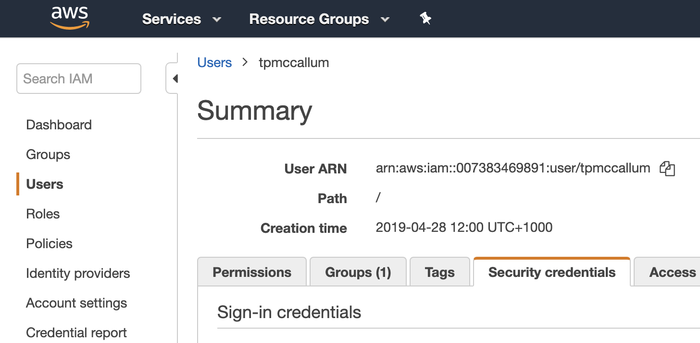
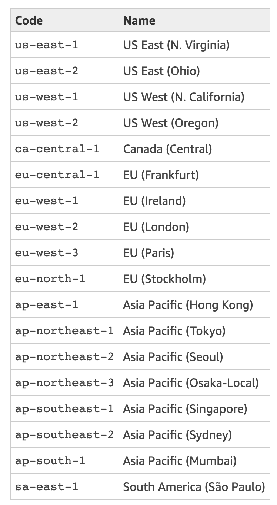
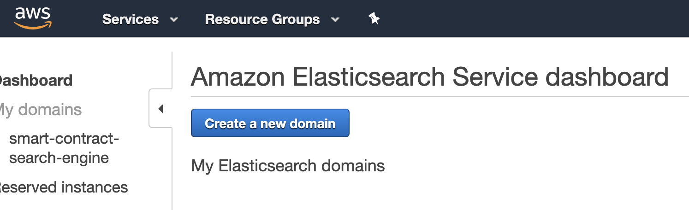
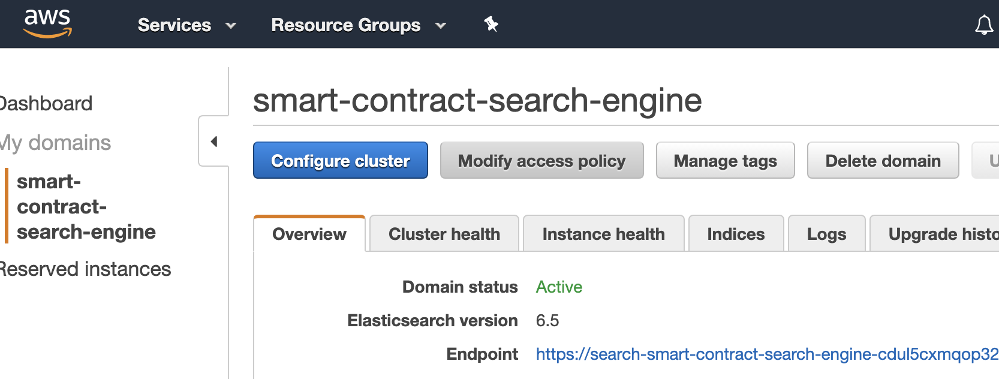
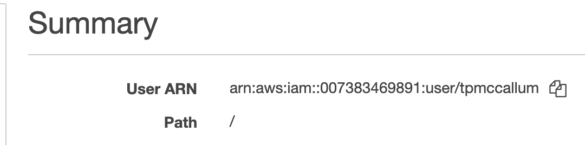

# Smart Contract Search Engine

This search engine is designed to run locally (from your file system without the need for a server).

This search engine can also be hosted publicly by simply copying this entire project into the htdocs folder of a LAMP server, as seen here < http://54.66.215.89/index.html >.

## Searching - Frontend

This system is running live at the following endpoint < http://54.66.215.89/index.html >. Please feel free to try it out, using the following examples of usage.

### Example usage

#### Search using address

You can search the system using the address of product-giveaway contract owners, product-giveaway players, product-giveaway winners and even product-giveaway smart contract addresses.


#### Search using plain text 

You can also search the system using plain text; for example try typing the word "demonstration" into the search box as shown below.


#### Search using both address and plain text

You can also search the system using plain text, with the addition of an address. The following example shows how the "demonstration" text (which produced 3 results above) is now filtered to a single contract address of `0x7e38f41F7562720D1F219D474C78d98152382BFe`. You can try this out for yourself, just paste in the address and text.

#### Show/Hide Details

To make the results cleaner, we have provided the clickable "Show / Hide Details" text. This will reveal or hide additional information such as the list of winners, block number of when the contract was last interacted with and so forth.


## Harvesting - Backend

The harvesting scripts are written in Python; they require a particular smart contract's ABI file and a link to the blockchain's RPC endpoint.

### Full - smart contract harvest

The Python file, at `python/SmartContractHarvesterFull.py` harvests the entire blockchain (in reverse, from the latest block, right back to the genesis block).

```python3
for blockNumber in reversed(range(latestBlockNumber)):
```

The full - smart contract harvest, technically, only needs to be run once. However, if you like you can set it to run once per day using a cron job such as the following. 

```bash
# m h  dom mon dow   command
45 22 * * * cd ~/htdocs/python && /usr/bin/python3 SmartContractHarvesterFull.py
# The above cron job will trigger at 10:45pm every day
# Please note that you can obtain your system's time using the "date" command
# Please note that the python path, for your unique system, can be obtained via the "which python3" command
```

Keep in mind, the full - smart contract harvest does check if each contract instance already exists (and so there is no real downside to running it daily or weekly). Think of this harvest as a full sweep of the entire blockchain.

You can check to see if the `SmartContractHarvesterFull.py` script is running via the following command.

```bash
ps ax | grep SmartContractHarvesterFull.py
```
**Note:** You can supress the output from the cron job by adding the following to the end of the line. This prevents the /var/mail of your OS from growing too large.
```
>/dev/null 2>&1
```

### Topup - smart contract harvest

The Python file, at `python/SmartContractHarvesterTopup.py` must be run regularly. This script, when run regularly, will index brand new smart contracts by scanning the most recent 350 blocks. 

```python3
stop = latestBlockNumber - 350
for blockNumber in reversed(range(stop, latestBlockNumber)):
```

The topup - smart contract harvest, can be run once per minute using the following cron job. Again, remember that this script will only index contract instances which do not already exist in the index. If a contract instance already exists this script will just skip over it and continue looking for new unindexed contract instances. This is a very cheap and efficient script; essentially just sweeps a finite amount of upper blocks in the chain over and over as time goes on.

```bash
* * * * * cd ~/htdocs/python && /usr/bin/python3 SmartContractHarvesterTopup.py
# The above cron job will trigger at every minute of every hour of every day
```

### Incremental  - smart contract **STATE** update

The above scripts primarily store the contract infrastructure (contract address, owner address etc.). Having the ABI and contract address means that we can create web3 instances of each contract instance; and then go ahead and read all of the contract's public variables. The above harvesting scripts do this **only once**.

The Python file, at `python/FairPlayStateUpdate.py` checks for changes in each contract's state in real-time. As soon as any change is detected, the main index is updated. The Python script does not repeatedly query the main index. Instead it locally compares hashes (hash(smart contract address + smart contract state)). This is very efficient and fast.

The output from the incremental smart contract state update looks like this (when contract state is unchanged)

```bash
No change to 0x06bf38c9b46227cc551dab2a54bd8c21027d1f3ce4e6310c2db2be98bbba44d8 
No change to 0xa899b93e1f99ade55665b79f4fdb879ecbb1598fa72dd433a6927861170d4d52 
No change to 0x0386dabea26abe1d76b80ed41da1fbb610f6f69b01d1da1766748e776f7b9da6 
No change to 0xe44d14f137d76faca652cc274d9e49907805569823a1847faea5712afcc77808 
No change to 0x296c32fef02a7a22601d6969b0d62ed24f8d43e36c11037f636512a5a06e8be2 
No change to 0x635a3120a62fcbdfc6f096f97e7144436ca5b76abd22109df0e31e8773222caa 
No change to 0x604a42cb3141c22d33517f403cb8a8cdccd85549f31bcccbb7e4ab73f7b2fb56 
No change to 0x5d7073be26976fe69ae8f4e0d546e3f3f106e4e2cb9285cad66752f468e9d0de 
No change to 0xb6023d7796882028d3f54c4dbc756ee6ace811484a99ab6d693058d65af62ccd 
```

### Configuring your own search engine system

Using the publicly available frontend is easy and free. However, if you would like to run your own infrastructure, please following the instructions below. These examples are all for the latest Ubuntu LTS. More specifically, you must use 18.04 because it comes with Python 3.6 (which Py Web3 requires).

#### Operating system libraries

Python3

```bash
sudo apt-get update
sudo apt-get upgrade
sudo apt-get install python3

# Or if using older Ubuntu, stipulate dev if/as required
sudo apt-get install python3.6-dev 
```
Pip3

```bash
sudo apt-get install python3-pip
pip3 install --upgrade pip --user

# Or if using older Ubuntu, stipulate 3.6 if/as required
python3.6 -m pip install web3 --user
```

Boto3

```bash
pip3 install boto3
```
AWS Requests Auth
```
pip3 install aws_requests_auth --user
```

AWS Command Line Interface (CLI)

```
pip3 install awscli --user
```

Configuring AWS CLI

```
aws configure
```
**AWS Access Key ID:** The aws configure script will request that you add your "AWS Access Key ID". Your AWS Access Key ID can be found by clicking on "users" and then the "security credentials" tab at your [console home](https://console.aws.amazon.com/iam/home); as shown below. If you are creating a new AWS Access Key ID, remember to store the Secret Access Key (as it is only ever displayed here this once) ... you will need the Secret Access Key in the next step.



**AWS Secret Access Key:** This is obtained when you create the AWS Access Key ID (as per the previous step).

**Default region name:** There is a table of regions, you can see the region in the top right corner of your EC2 console. Use the following table to convert this to the appropriate name i.e. Sydney = "ap-southeast-2".



**Default output format:** The default output format can stay as None; just hit enter.

Elasticsearch

```
pip3 install elasticsearch --user
```

#### Elasticsearch

**AWS provides Elasticsearch as a service. To set up an AWS Elasticsearch instance visit your AWS console using the following URL.**
```
https://console.aws.amazon.com/console/home
```
**Type "Elasticsearch" into the Find Services section of the AWS console.**


**Click the "Create a new domain" button.**



Choose the appropriate machine[s] for your cluster, keeping in mind [the pricing of each machine](https://aws.amazon.com/ec2/pricing/on-demand/). Remember that you can also set up [cost, usage and reservation budgets](https://console.aws.amazon.com/billing/home?region=us-east-1#/budgets/create?type=COST) as well as [cost alerts and cost forecasts](https://docs.aws.amazon.com/AmazonCloudWatch/latest/monitoring/monitor_estimated_charges_with_cloudwatch.html) to avoid surprises. Please also remember that Elasticsearch instances (domains and indexes) are region specific. Make sure that you remember which region you used to initialize the instance (you will also need this region information later for authentication and access control).

#### Amazon Web Services (AWS)

**Authentication and access control**

All of the blockchain data is public so there is no real need to restric access. However, we want to ensure that this global access is **Read-Only** and that write access is restricted to the appropriate IP/Domain/User etc.

Please read the [Amazon Elasticsearch Service Access Control](https://docs.aws.amazon.com/elasticsearch-service/latest/developerguide/es-ac.html) documentation. This very flexible authentication and access control can be set up after the fact by writing a policy.

To modify the policy, for a specific index, click on the "Modify access policy" button.



**Restrict public to view only (HTTP GET only) while allowing your AWS user to perform any task**
```
{
  "Version": "2012-10-17",
  "Statement": [
    {
      "Effect": "Allow",
      "Principal": {
        "AWS": "arn:aws:iam::007383469891:user/tpmccallum"
      },
      "Action": "es:*",
      "Resource": "arn:aws:es:ap-southeast-2:007383469891:domain/smart-contract-search-engine/*"
    },
    {
      "Effect": "Allow",
      "Principal": {
        "AWS": "*"
      },
      "Action": "es:ESHttpGet",
      "Resource": "arn:aws:es:ap-southeast-2:007383469891:domain/smart-contract-search-engine/*"
    }
  ]
}
```

**Note:** The `Action` for the `Principal` (with the IAM user) is `es:*` (wildcard) and in contrast the `Action` for the `Principal` (open to the public) is restructed to only HTTP Get (`es:ESHttpGet`)


The arn:aws:iam above can be found in [your AWS IAM console](https://console.aws.amazon.com/iam/home#/home)



#### AWS CLI
Install the cli
https://docs.aws.amazon.com/cli/latest/userguide/cli-chap-install.html

Configure the cli using aws configure
https://docs.aws.amazon.com/cli/latest/userguide/cli-chap-configure.html
https://docs.aws.amazon.com/cli/latest/reference/configure/

More documentation coming soon ...


