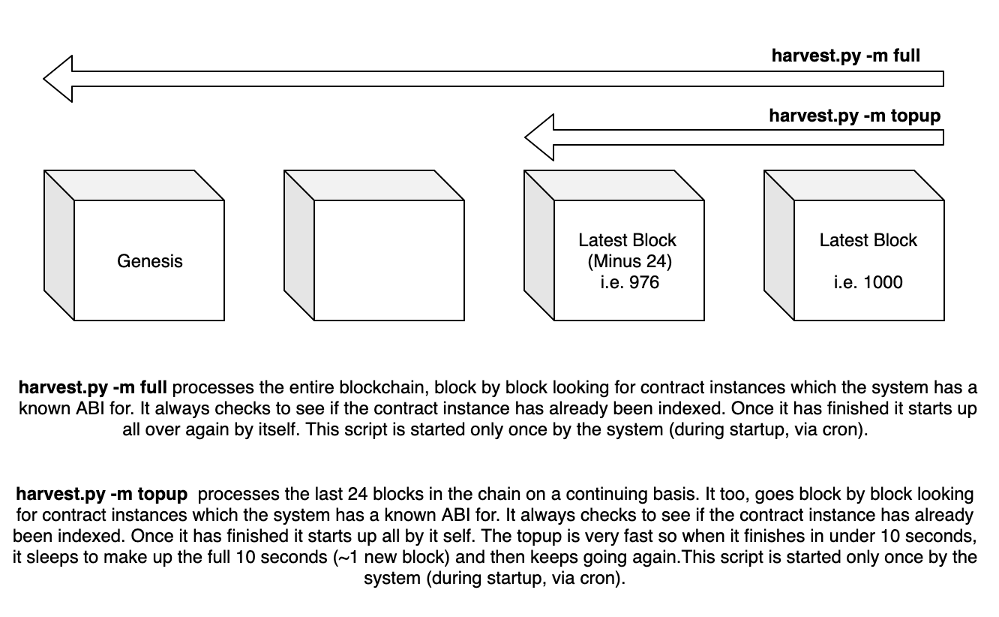
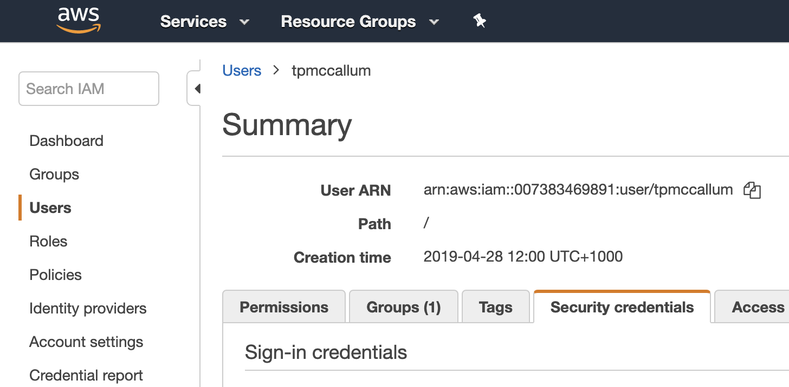
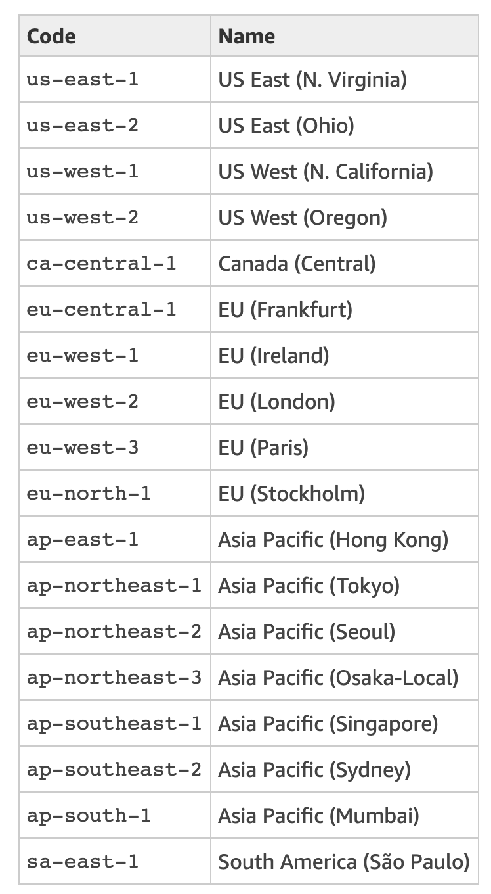
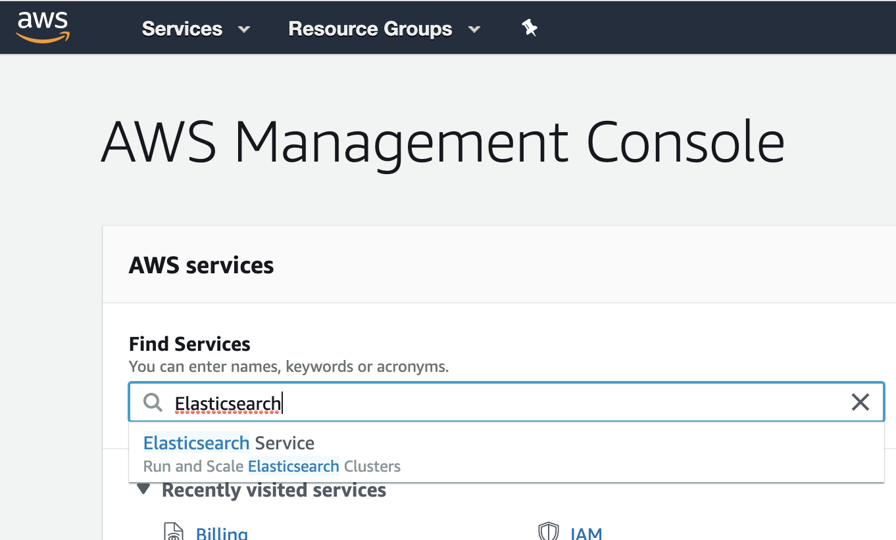
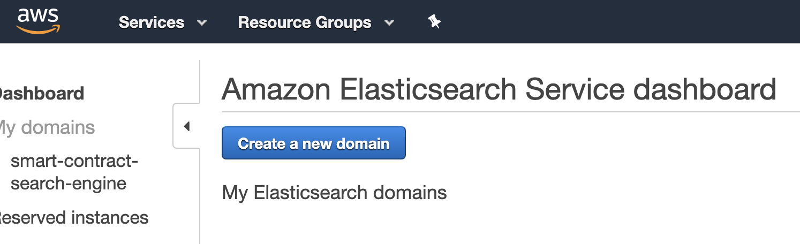
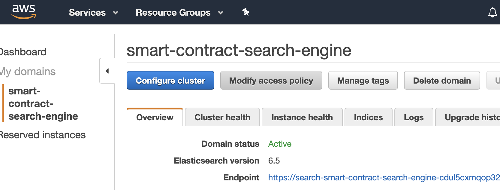
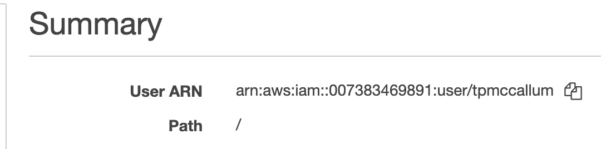

## Harvesting 

The harvesting code is written in Python; it requires a particular smart contract's ABI and bytecode as well as a link to the blockchain (an RPC endpoint to the network where the contract was deployed)

### Getting the code
Simply clone the repository.
```
git clone https://github.com/second-state/smart-contract-search-engine.git
```

### Configuring the harvesting code
Open the [config.ini](https://github.com/second-state/smart-contract-search-engine/blob/master/python/config.ini) file. 

- Provide a single link to the blockchain's RPC endpoint in the blockchain section
```
[blockchain]
rpc = https://testnet-rpc.cybermiles.io:8545
```
- Provide a link to the Elasticsearch endpoint in the elasticSearch section
```
[elasticSearch]
endpoint = search-smart-contract-search-engine-12345.ap-southeast-2.es.amazonaws.com
aws_region = ap-southeast-2
```
## Initial harvest - Phase 1 (must commence before phase 2)

**UPDATE - now 100x faster than before** 
This harvest_all.py script has been upgraded to perform the `-m full` mode of harvesting 100x faster than it used to. Here is the logic of the code. This code logic is just for your interest; the code will just work 100x faster now if you just run the same command.
```
# -m full code gets the latest block number
latestBlockNumber = harvester.web3.eth.getBlock('latest').number
# then facilitates one hundred separate IO threads
threadsToUse = 100
# then it will work out how many blocks will be harvested per thread
blocksPerThread = int(latestBlockNumber / threadsToUse)
# the harvestAllContracts function is then called 100 separate times simultaneously using these unique block number parameters
```
The good thing about this method is that each of the threads starts at even spacings in the blockchain so there is an evenly spread amount of block harvesting going on simultaneously. The harvest_all.py can be raised above 100x by adjusting the `threadsToUse` variable. We are just using this here because the m5.large instance from AWS is comfortable at about 60% CPU. Please check your servers capacity under load using `top` and increase this number to what you see fit.

**Command line usage**
```
python3.6 harvest_all.py -h
usage: harvest_all.py [-h] [-m MODE]

Harvester < https://github.com/second-state/smart-contract-search-engine >

optional arguments:
  -h, --help            show this help message and exit
  -m MODE, --mode MODE  [full|topup]
```

### Recommended usage - Run once at startup!
**Run at startup**

Technically speaking (in the long term) once the project is well underway, you will just want to run all of these commands the **one** time, at startup! i.e. ensure that they are always running.

The system will take care of itself. Here is an example of how to run this once at startup.

**Phase 1 - Step 1**
Create a bash file, say, `~/startup1.sh` and make it executable with the `chmod a+x` command. Then put the following code in the file.
Please be sure to replace `https://testnet-rpc.cybermiles.ii:8545` with that of your RPC.
```bash
#!/bin/bash
while true
do
  STATUS=$(curl --max-time 30 -s -o /dev/null -w '%{http_code}' https://testnet-rpc.cybermiles.io:8545)
  if [ $STATUS -eq 200 ]; then
    cd ~/smart-contract-search-engine/python && nohup /usr/bin/python3.6 harvest_all.py -m full >/dev/null 2>&1 &
    cd ~/smart-contract-search-engine/python && nohup /usr/bin/python3.6 harvest_all.py -m topup >/dev/null 2>&1 &
    break
  else
    echo "Got $STATUS please wait"
  fi
  sleep 10
done
``` 
**Phase 1 - Step 2**
Add the following command to cron using `crontab -e` command.
```bash
@reboot ~/startup1.sh
```

## Subsequent harvest - Phase 2 (must only commence once phase 1 is well underway)
```
cd ~/smart-contract-search-engine/python

python3.6 harvest.py -h

usage: harvest.py [-h] [-m MODE]

optional arguments:
  -h, --help            show this help message and exit
  -m MODE, --mode MODE  [full|topup|state]
```

### Full - smart contract harvest

The Python file, at `python/harvest.py` harvests the entire blockchain (in reverse, from the latest block, right back to the genesis block).

```python3
python3.6 harvest.py -m full
```

Keep in mind, the full - smart contract harvest does check if each contract instance already exists (and so there is no real downside if it ever runs more than once.

```bash
cd ~/smart-contract-search-engine/python && nohup /usr/bin/python3.6 harvest.py -m full >/dev/null 2>&1 &
```

### Topup - smart contract harvest

The Python file, at `python/harvest.py` harvests only the most recent blocks in the chain. This does not have to be repeated in a cron task etc. This will loop over the most recent blocks in the chain over and over without stopping.

```bash
cd ~/smart-contract-search-engine/python && nohup /usr/bin/python3.6 harvest.py -m topup >/dev/null 2>&1 &
```

### Update - smart contract harvest

The Python file, at `python/harvest.py` also continously updates the state of already harvested contracts.

```bash
cd ~/smart-contract-search-engine/python && nohup /usr/bin/python3.6 harvest.py -m state >/dev/null 2>&1 &
```

This state update will also run repeatedly without the need for calling this command again. 

### Recommended usage - Run once at startup!
**Run at startup**

Technically speaking you will just want to run all of these commands the **one** time, at startup!. 
The system will take care of itself. Here is an example of how to run this once at startup.

**Phase 2**


**Phase 2 - Step 1**
Create a bash file, say, `~/startup2.sh` and make it executable with the `chmod a+x` command. Then put the following code in the file.
```bash
#!/bin/bash
while true
do
  STATUS=$(curl --max-time 30 -s -o /dev/null -w '%{http_code}' https://testnet-rpc.cybermiles.io:8545)
  if [ $STATUS -eq 200 ]; then
    cd ~/smart-contract-search-engine/python && nohup /usr/bin/python3.6 harvest.py -m full >/dev/null 2>&1 &
    cd ~/smart-contract-search-engine/python && nohup /usr/bin/python3.6 harvest.py -m topup >/dev/null 2>&1 &
    cd ~/smart-contract-search-engine/python && nohup /usr/bin/python3.6 harvest.py -m state >/dev/null 2>&1 &
    break
  else
    echo "Got $STATUS please wait"
  fi
```
**Phase 2 - Step 2**
Add the following command to cron using `crontab -e` command.
```bash
@reboot ~/startup2.sh
```
The smart contract search engine will autonomously harvest upon bootup.

# Preparing your system for harvesting

The harvesting/indexing requires a few software libraries (to enable Python to talk to blockchain RPC, Elasticsearch as well as fetch data from URLs etc.). Please follow these instructions to ensure that your system can successfully run the Python scripts.

## Operating system libraries

Python3

```bash
sudo apt-get -y update
sudo apt-get -y upgrade

# If using Ubuntu 18.04LTS Python 3.6 will already be installed

# If using older Ubuntu, you will need to install Python3.6 and Python3.6-dev 
#sudo add-apt-repository ppa:jonathonf/python-3.6
#sudo apt-get -y update
#sudo apt-get install python3.6-dev 
```
Pip3

```bash
sudo apt-get -y install python3-pip
```

Web3

```
python3.6 -m pip install web3 --user
```

Boto3

```bash
python3.6 -m pip install boto3 --user
```
AWS Requests Auth
```
python3.6 -m pip install aws_requests_auth --user
```

AWS Command Line Interface (CLI)

```
sudo apt-get install awscli
```

Configuring AWS CLI

```
aws configure
```
**AWS Access Key ID:** The aws configure script will request that you add your "AWS Access Key ID". Your AWS Access Key ID can be found by clicking on "users" and then the "security credentials" tab at your [console home](https://console.aws.amazon.com/iam/home); as shown below. If you are creating a new AWS Access Key ID, remember to store the Secret Access Key (as it is only ever displayed here this once) ... you will need the Secret Access Key in the next step.



**AWS Secret Access Key:** This is obtained when you create the AWS Access Key ID (as per the previous step).

**Default region name:** There is a table of regions, you can see the region in the top right corner of your EC2 console. Use the following table to convert this to the appropriate name i.e. Sydney = "ap-southeast-2".



**Default output format:** The default output format can stay as None; just hit enter.

Elasticsearch

```
python3.6 -m pip install elasticsearch --user
```

## Elasticsearch

**AWS provides Elasticsearch as a service. To set up an AWS Elasticsearch instance visit your AWS console using the following URL.**
```
https://console.aws.amazon.com/console/home
```
**Type "Elasticsearch" into the Find Services section of the AWS console.**



**Click the "Create a new domain" button.**



Choose the appropriate machine[s] for your cluster, keeping in mind [the pricing of each machine](https://aws.amazon.com/ec2/pricing/on-demand/). Remember that you can also set up [cost, usage and reservation budgets](https://console.aws.amazon.com/billing/home?region=us-east-1#/budgets/create?type=COST) as well as [cost alerts and cost forecasts](https://docs.aws.amazon.com/AmazonCloudWatch/latest/monitoring/monitor_estimated_charges_with_cloudwatch.html) to avoid surprises. Please also remember that Elasticsearch instances (domains and indexes) are region specific. Make sure that you remember which region you used to initialize the instance (you will also need this region information later for authentication and access control).

## Amazon Web Services (AWS)

**Authentication and access control**

All of the blockchain data is public so there is no real need to restric access. However, we want to ensure that this global access is **Read-Only** and that write access is restricted to the appropriate IP/Domain/User etc.

Please read the [Amazon Elasticsearch Service Access Control](https://docs.aws.amazon.com/elasticsearch-service/latest/developerguide/es-ac.html) documentation. This very flexible authentication and access control can be set up after the fact by writing a policy.

To modify the policy, for a specific index, click on the "Modify access policy" button.



**Restrict everyone, but allow your AWS user to perform any task**
We have just set up `aws configure` on our search engine server, so now its file system has the ability to communicate with the Elasticsearch index. It does so on behalf of a particular end user who's entry point into our system is that end user's web browser. In the global set up we use a combination of Python flask, Apache2 and a ReverseProxy. It is all very easy to set up, as documented in the [global_mode.md](https://github.com/second-state/smart-contract-search-engine/blob/master/documentation/global_mode.md)
```
{
  "Version": "2012-10-17",
  "Statement": [
    {
      "Effect": "Allow",
      "Principal": {
        "AWS": "arn:aws:iam::007383469891:user/tpmccallum"
      },
      "Action": "es:*",
      "Resource": "arn:aws:es:ap-southeast-2:007383469891:domain/smart-contract-search-engine/*"
    }
  ]
}
```

**Note:** The `Action` for the `Principal` (with the IAM user) is `es:*` (wildcard) and in contrast the `Action` for the `Principal` (open to the public) is restructed to only HTTP Get (`es:ESHttpGet`)


The arn:aws:iam above can be found in [your AWS IAM console](https://console.aws.amazon.com/iam/home#/home)



# Known system errors

## Error 1
ModuleNotFoundError: No module named 'apt_pkg'

## Fix 1
```
sudo apt-get remove python3-apt
sudo apt-get install python3-apt
```

## Error 2
RequestsDependencyWarning: urllib3 (1.25.2) or chardet (3.0.4) doesn't match a supported version!

## Fix 2
```
python3.6 -m pip uninstall chardet
python3.6 -m pip uninstall urllib3
python3.6 -m pip install urllib3 --user
python3.6 -m pip install chardet --user
python3.6 -m pip uninstall requests
python3.6 -m pip install requests --user
```


