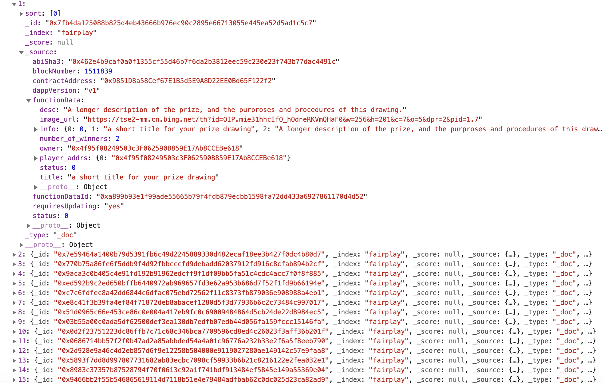

# Usage

The search engine can be used, by end users, via their web browser. It can also provide data to users and machines via the public facing API.

## API usage

** Curl **
```bash
curl -X GET "https://cmt-testnet.search.secondstate.io/api/es_search" -H 'Content-Type: application/json' -d' {"query": {"match": {"contractAddress": "0x909350a510BCf568e66019E21F1598D8282be26C"}}}'
```
Returns
```bash
curl -X GET "http://54.252.157.165/api/data1" -H 'Content-Type: application/json' -d' {"query": {"match": {"contractAddress": "0x0fEB15a0F7029b0F4aF355aa2Fc3CFa6Df7C8483"}}}'
{
  "1": {
    "_id": "0x9aca3c0b405c4e91fd192b91962edcff9f1df09bb5fa51c4cdc4acc7f0f8f885", 
    "_index": "fairplay", 
    "_score": null, 
    "_source": {
      "abiSha3": "0x462e4b9caf0a0f1355cf55d46b7f6da2b3812eec59c230e23f743b77dac4491c", 
      "blockNumber": 1570763, 
      "contractAddress": "0x0fEB15a0F7029b0F4aF355aa2Fc3CFa6Df7C8483", 
      "dappVersion": "v1", 
      "functionData": {
        "desc": "\u662f\u6211\u7684", 
        "image_url": "https://res.cloudinary.com/dgvnn4efo/image/upload/v1556439508/ud5bemheembjv5bvbe4g.png", 
        "info": {
          "0": 0, 
          "1": "\u53e6\u4e00\u4e2a", 
          "2": "\u662f\u6211\u7684", 
          "3": "https://res.cloudinary.com/dgvnn4efo/image/upload/v1556439508/ud5bemheembjv5bvbe4g.png", 
          "4": 2, 
          "5": 1556439809
        }, 
        "number_of_winners": 2, 
        "owner": "0x9F36535b7a46850B428D6e997D817019b7fC6d69", 
        "status": 0, 
        "title": "\u53e6\u4e00\u4e2a"
      }, 
      "functionDataId": "0x9b378652f4ceb518e630d73199b37bb904c4f0b22c77eaba036dba371c90042c", 
      "requiresUpdating": "yes", 
      "status": 0
    }, 
    "_type": "_doc", 
    "sort": [
      1
    ]
  }
}
```

** Javascript **
```javascript
_data = {
    "query": {
        "match_all": {}
    }
}
var _dataString = JSON.stringify(_data);
$.ajax({
    url: "http://54.252.157.165/api/data2",
    type: "POST",
    data: _dataString,
    dataType: "json",
    contentType: "application/json",
    success: function(response) {
        console.log(response);
    },
    error: function(xhr) {
        console.log("Get items failed");
    }
});
```
Returns


